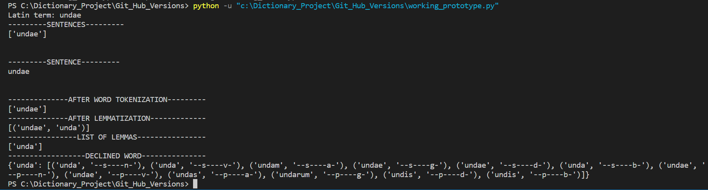
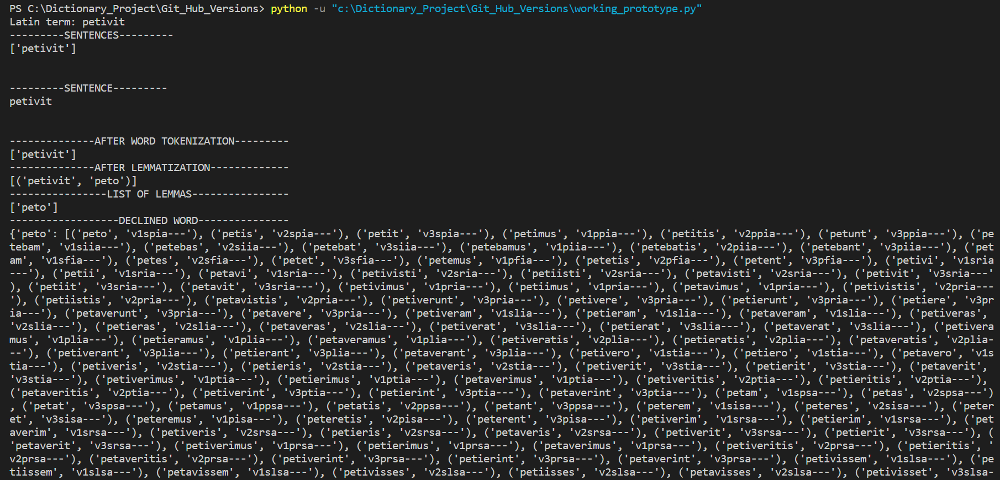
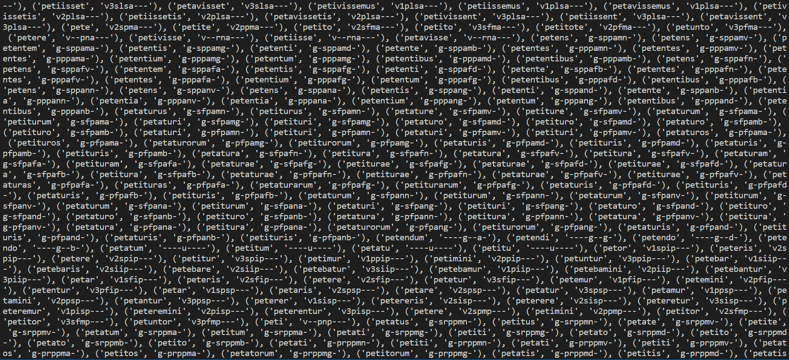

# Latin Dictionary

## Why a Latin Dictionary?
This project is a confluence of my two passions, Natural Language Processing and Latin. When reading in Latin, which is a highly inflected language, I often encounter
unfamiliar verbs and nouns, and knowing tense, gender, and case is vital to the understanding of the text. I would often use tools such as Whitaker's Words and Wiktionary, but when I travel or have a poor Internet connection, a dictionary running on my local computer would be so much more convenient. So, I decided to create my own (for now, a command-line) dictionary, which would combine the functionality of the two existing dictionaries I mentioned. 

## Dictionary Functionality and Limitations
The final version of the dictionary will have a user menu with the following options:
1) Display a Latin->English translation of the entered word
2) Display a conjugation/declension table for the entered word/sentence
3) Display both the table and the translation

A user will be prompted to enter a Latin term or sentence. Then, the menu described above will appear and by pressing 1, 2, or 3 on the keyboard, the user can choose
the option he needs.

(The "Progress" paragraph below discusses the current stage the project is in)

## Progress
October 19, 2022: Uploaded the first working prototype! In this first version, I implemented the 2nd option from the user menu, which is a conjugation/declension table.

Entering a noun "undae", which means "of a wave":

Entering a verb "petivit", which means "He/she aims at":

## Learning and Challenges

## References & Resources Utilized
